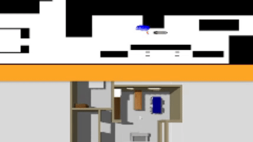

# Monte Carlo Laser-Based Robot Localization

<p align="center">
  
</p>

## Overview

This project implements a **Particle Filter (Monte Carlo Localization - MCL)** for mobile robot localization in a known environment using the Robotics Academy platform.

The algorithm estimates the robot pose by combining:

- Odometry data (motion model)
- Laser sensor measurements (observation model)
- Particle resampling
- Pose estimation from weighted particles

---

## Features

- Particle initialization
- Motion update using odometry
- Laser-based observation model
- Multinomial resampling
- Pose estimation using weighted particles
- Visualization in Robotics Academy

---

## Technologies

- Python
- Robotics Academy
- ROS 2
- Gazebo
- Docker

---

## Project Structure

```text
.
├── academy.py
├── README.md
└── docs
    └── montecarlo-demo.gif
```

---

## How it Works

The localization algorithm follows the classic Monte Carlo Localization pipeline:

1. Initialize particles.
2. Propagate particles using the robot motion.
3. Compare laser measurements with simulated laser readings.
4. Update particle weights.
5. Normalize the weights.
6. Resample particles.
7. Estimate the robot pose.

---

## Course Information

**Course:** Introduction to Mobile Robotics

**Institution:** Federal University of Alagoas (UFAL)

---

## Author

**Mariana Lins**
